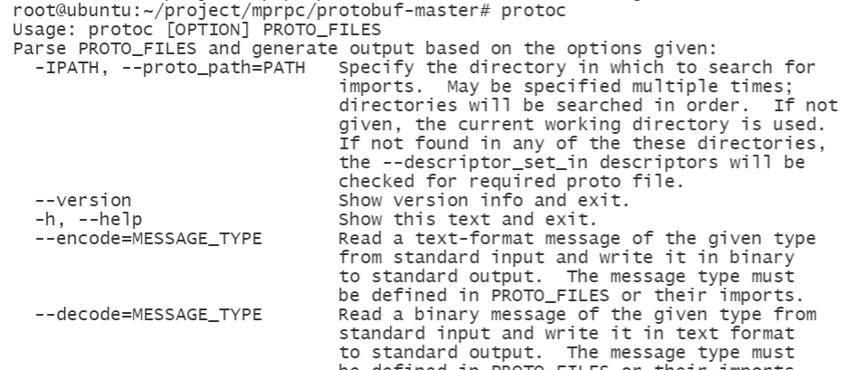

# 代码分析

## protobuf测试

1、解压压缩包：unzip protobuf-master.zip

2、进入解压后的文件夹：cd protobuf-master

3、安装所需工具：sudo apt-get install autoconf automake libtool curl make g++ unzip

4、自动生成configure配置文件：./autogen.sh

5、配置环境：./configure

6、编译源代码(时间比较长)：make

7、安装：sudo make install

8、刷新动态库：sudo ldconfig

输入protoc命令

# 遇到的问题

## 虚拟机磁盘空间不足

https://www.cnblogs.com/ZHJ0125/p/12904471.html

https://www.bilibili.com/s/video/BV1vv411e7kp

https://www.codenong.com/cs106563971/